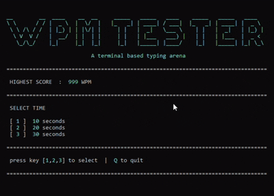

# Typing Speed (WPM) Tester
---
This is a typing speed tester (in WPM) built in C providing a menu to select the mode: 
* 1 for 10 seconds
* 2 for 20 seconds
* 3 for 30 seconds <br>

Selecting the mode, typer goes to the arena where real time WPM, accuracy, progress are calculated and the result screen is shown to the user.




## Features
---
- Real time WPM, accuracy, and progress bar updated as typer type
- Three time modes — 10, 20, and 30 seconds
- Randomly selected paragraphs from anime dialogues
- Green / red character acc to corrct or mistake
- Backspace support including going back to previous lines
- Highest score saved and shown
- Optimized WPM calculated from raw WPM and accuracy

This project is group project made in a team of 4 members in 1st sem.<br>

<b>Team Members</b>
* Brishkamal Karki
* Bisesh Khatri
* Chandan Panjiyar
* Pranav Sharma

## Getting Started
---

### Clone the repository

```bash
git clone https://github.com/BrishkamalKarki/typing-speed-tester
cd typing-speed-tester
```

### Compile

```bash
gcc engine.c mainMenu.c resultScreen.c main.c -o WPM.exe
```

### Run

```bash
start WPM.exe
```

## File Structure
---
```bash
typing-speed-tester/
│
├── main.c
├── main.h
├── mainMenu.c
├── mainMenu.h
├── engine.c
├── engine.h
├── resultScreen.c
├── features.h
├── sentences.txt
└── highestScore.txt
```